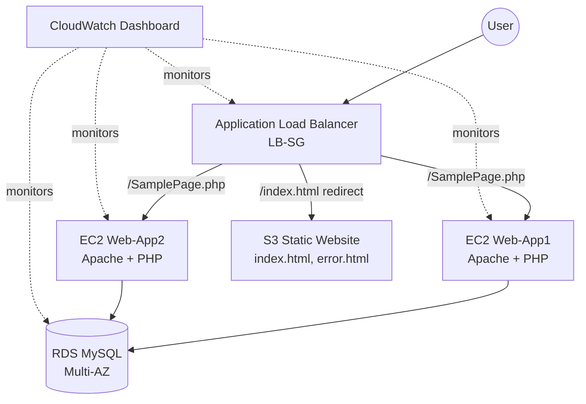
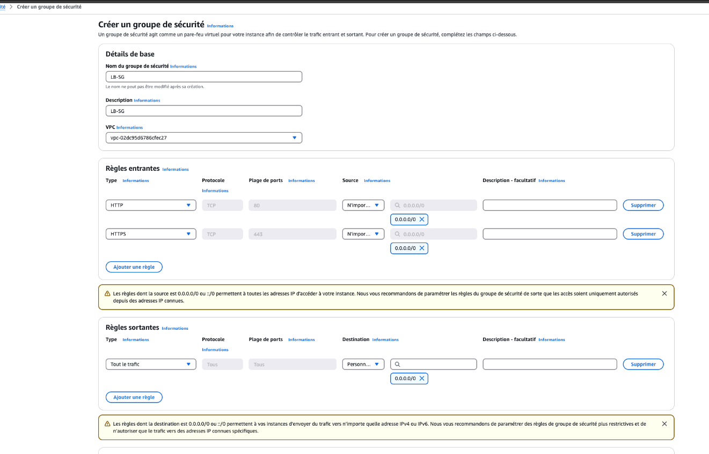
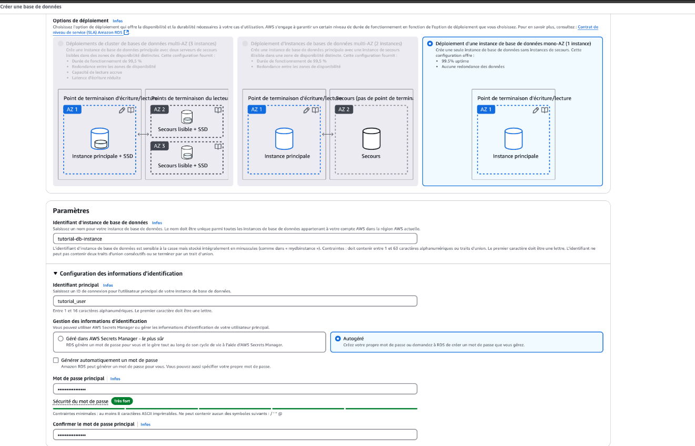
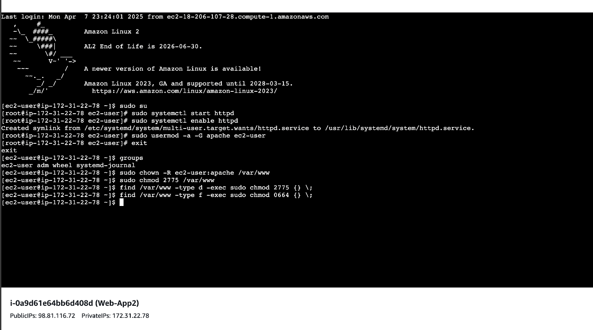
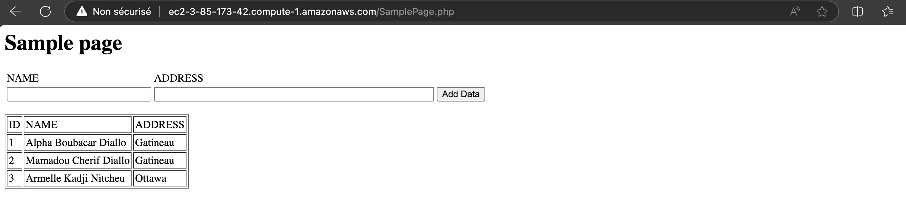
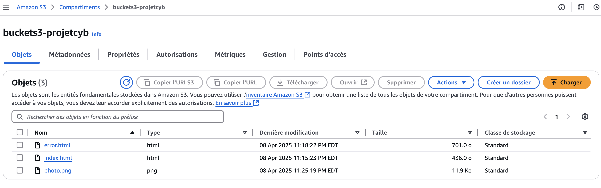
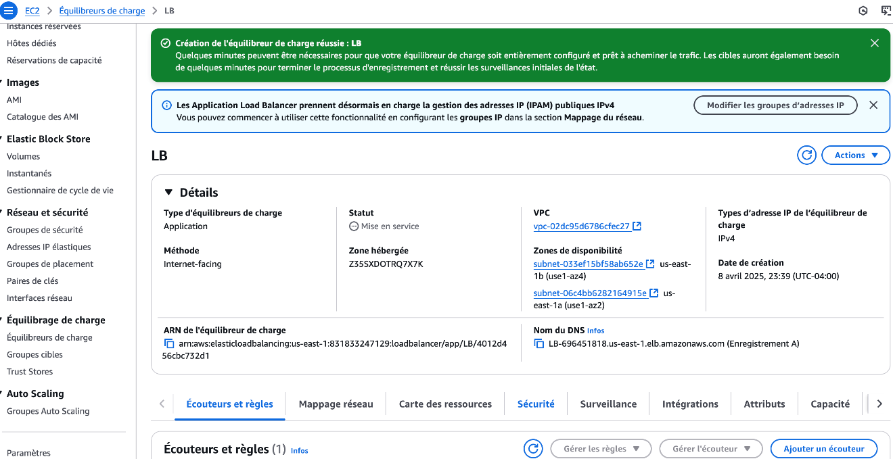
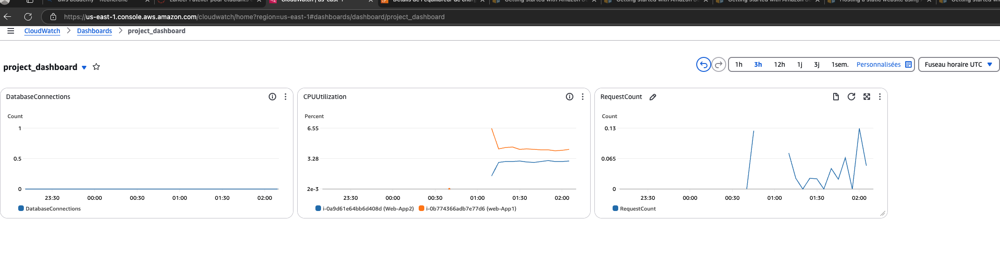

# Employee Directory Deployment on AWS

A multi-tier web application deployed on AWS, combining compute, managed database, static hosting, load balancing, and monitoring into a single architecture.

## Overview

This project deploys a PHP/MySQL employee directory application on AWS using a highly-available, load-balanced architecture. It covers network security design, database management with Amazon RDS, static site hosting with S3, traffic distribution with an Application Load Balancer, and infrastructure monitoring with CloudWatch.

## Architecture

## Components

### 1. Network Security (Security Groups)

Three security groups isolate traffic by role:

| Security Group | Purpose | Key Rules |
|---|---|---|
| **Web-SG** | Web/app servers | HTTP (80) + SSH (22) |
| **DB-SG** | Database | MySQL (3306) — inbound only from Web-SG |
| **LB-SG** | Load balancer | HTTP (80) from the internet |

### 2. Database — Amazon RDS (MySQL)

- Multi-AZ deployment for high availability
- Dedicated application user with scoped permissions (no root access from the app)

### 3. Compute — EC2 + Apache + PHP

- 2× EC2 instances (t2.micro) across two Availability Zones
- Apache and PHP installed and configured via SSH
- Application connects to RDS using credentials loaded at runtime (see Security Notes below)

### 4. Static Hosting — Amazon S3

- S3 bucket configured for static website hosting (`index.html`, `error.html`)
- Public read access scoped via a bucket policy limited to `s3:GetObject`

### 5. Load Balancing — Application Load Balancer

- Path-based routing: `/SamplePage.php` → EC2 target group, `/index.html` → S3 static site
- Health checks against the EC2 target group

### 6. Monitoring — CloudWatch

Custom dashboard tracking:
- `RequestCount` (Load Balancer)
- `DatabaseConnections` (RDS)
- `NumberOfObjects` (S3)
- `CPUUtilization` (EC2)

## Tech Stack

AWS (EC2, RDS, S3, Application Load Balancer, CloudWatch, VPC, Security Groups) · Apache · PHP · MySQL

## Security Notes & Lessons Learned

Being transparent about trade-offs made in a learning context, and what a production setup would change:

- **SSH exposure:** Web-SG currently allows SSH (port 22) from `0.0.0.0/0`. AWS itself flags this in the console. In production, this should be restricted to a specific IP range (VPN, bastion host, or known admin IPs).
- **Credential management:** Database credentials should be loaded from environment variables or a secrets manager (e.g., AWS Secrets Manager), never hardcoded in source files.
- **SQL injection protection:** The current implementation uses `mysqli_real_escape_string`. A production version would use prepared statements (PDO or `mysqli` with `bind_param`) for stronger protection.
- **HTTPS:** HTTPS (443) is allowed at the security group level; a production deployment would terminate SSL/TLS at the load balancer with a proper certificate (AWS Certificate Manager).

## Setup (High-Level)

1. Create the three security groups (Web-SG, DB-SG, LB-SG) with the rules above
2. Launch an RDS MySQL instance (Multi-AZ) within DB-SG
3. Launch EC2 instances within Web-SG, install Apache/PHP, deploy the application code
4. Create an S3 bucket, enable static website hosting, upload static assets, apply a public-read bucket policy
5. Create an Application Load Balancer with a target group pointing to the EC2 instances, and configure path-based routing rules
6. Build a CloudWatch dashboard tracking the key metrics above

*Note: exact resource names, bucket names, and credentials used during development have been omitted/redacted here — configure your own values and load secrets from environment variables, not source code.*

## Team

- **Alpha Boubacar Diallo**
- Mamadou Cherif Diallo
- Armelle Kadji Nitcheu

*Project completed as part of a Computer Science course at Université du Québec en Outaouais (UQO).*

## Screenshots

**Security Groups configuration**

**RDS MySQL database creation**

**EC2 instance setup via SSH (Apache installation)**

**Application running end-to-end**

**S3 static website bucket**

**Application Load Balancer, successfully provisioned**

**CloudWatch monitoring dashboard**

